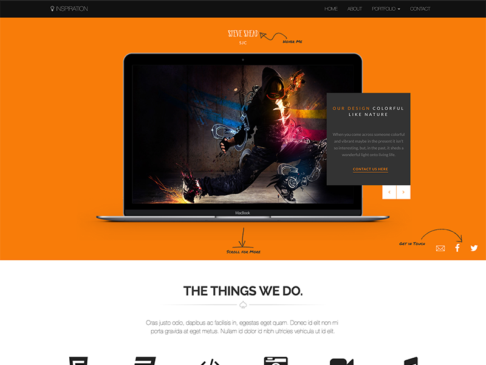
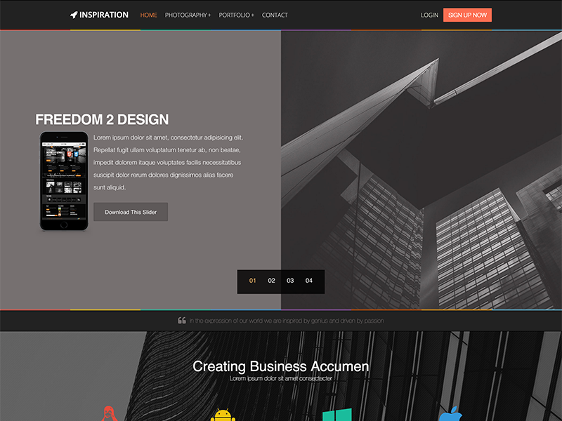

<!DOCTYPE html>
<html lang="en">
    <head>
        <meta charset="utf-8">
        <meta http-equiv="X-UA-Compatible" content="IE=edge">
        <meta name="viewport" content="width=device-width, initial-scale=1">
        <meta name="description" content="Steve Shead - Inspired by Genius - Driven by Passion - My Themes and Templates - My T-Shirt Designs - This is Me!">
        <meta name="author" content="Steve Shead">
        <title>Steve Shead - This Is Me.</title>
        <!-- Bootstrap core CSS -->
        <!-- Custom styles for this template -->
        <!-- HTML5 shim and Respond.js for IE8 support of HTML5 elements and media queries -->
        <!--[if lt IE 9]>
      
      
    <![endif]-->
        <link href="bootstrap/css/bootstrap.css" rel="stylesheet" type="text/css">
        <link href="style.css" rel="stylesheet" type="text/css">
        <link rel="stylesheet" href="https://cdnjs.cloudflare.com/ajax/libs/font-awesome/4.6.3/css/font-awesome.min.css">
    </head>
    <body>
        <section id="html" class="code">
            

                

                    

                        <h1>Image Hover Overlay</h1>
                        
Creative Image Overlay Effect

                    

                

                

                    

                        

                            
                            

                                <h2>Agency Theme</h2>
                                <a class="btn btn-outline-white" href="https://steveshead.github.io/bootstrap3-agency/" target="_blank">PREVIEW</a>
                            

                        

                        <h4><a href="https://steveshead.github.io/bootstrap3-agency/" target="_blank">Agency Theme</a></h4>
                    

                    

                        

                            
                            

                                <h2>Business Theme</h2>
                                <a class="btn btn-outline-white" href="https://steveshead.github.io/bootstrap3-business/" target="_blank">PREVIEW</a>
                            

                        

                        <h4><a href="https://steveshead.github.io/bootstrap3-business/" target="_blank">Business Theme</a></h4>
                    

                    

                        

                            
                            

                                <h2>Immortal Theme</h2>
                                <a class="btn btn-outline-white" href="https://steveshead.github.io/bootstrap3-immortal/" target="_blank">PREVIEW</a>
                            

                        

                        <h4><a href="https://steveshead.github.io/bootstrap3-immortal/" target="_blank">Immortal Theme</a></h4>
                    

                    

                        

                            
                            

                                <h2>Slider Theme</h2>
                                <a class="btn btn-outline-white" href="https://steveshead.github.io/bootstrap3-slider/" target="_blank">PREVIEW</a>
                            

                        

                        <h4><a href="https://steveshead.github.io/bootstrap3-slider/" target="_blank">Slider Theme</a></h4>
                    

                

            

        </section>

        <!-- Bootstrap core JavaScript -->
    <!-- ================================================== -->
        <!-- Placed at the end of the document so the pages load faster -->
        
        
        <!-- IE10 viewport hack for Surface/desktop Windows 8 bug -->
        
    </body>
</html>
# image hover overlay
Image Hover Overlay

Code for creating an image hover overlay.

Thanks!